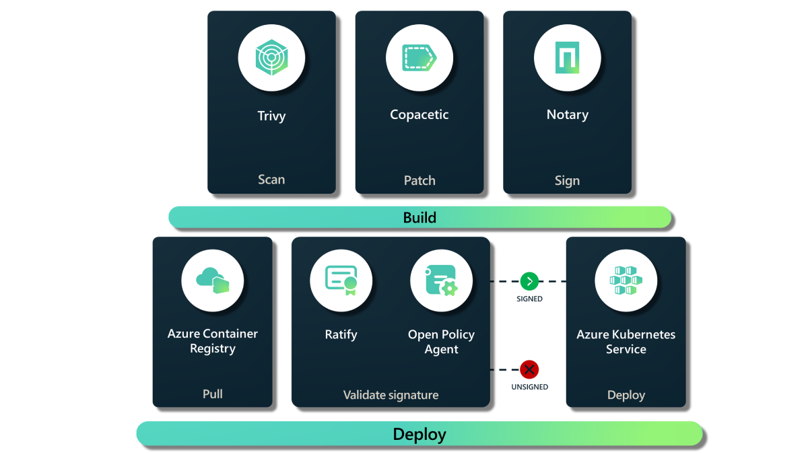

# 🔑 Secure Supply Chain AKS

Learn how to secure your container deployments on Azure Kubernetes Service by using open-source tools.

- [Trivy](https://github.com/aquasecurity/trivy) scans container images for vulnerabilities
- [Coptaic](https://github.com/project-copacetic/copacetic) patches container images using reports from vulnerability scanners
- [Notary](https://github.com/notaryproject/notary) signs container images with digital signatures
- [Gatekeeper](https://github.com/open-policy-agent/gatekeeper-library) policy enforcement for Kubernetes
- [Ratify](https://github.com/deislabs/ratify) admission controller for Kubernetes

By combining these tools, you can create a secure supply chain for your container deployments on Azure Kubernetes Service.

👉 [Watch the MSBuild 2023 Talk](https://www.youtube.com/watch?v=Mep9QWc3ByE&t=1s)